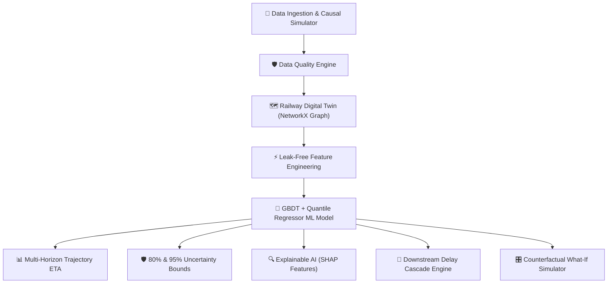

# 🚆 RAILCAST AI — Dynamic Railway ETA Forecasting & Causal Operations Intelligence Platform

> **Smart India Hackathon 2026 (SIH26028)**  
> *"Predict the arrival. Anticipate the network."*

---

## 📍 Project Location & Environment Details

| Component | Path / Address | Status |
| :--- | :--- | :--- |
| **Root Workspace** | `C:\Users\Sampriti\.gemini\antigravity\scratch\railcast-ai\` | Active |
| **Backend Codebase** | `C:\Users\Sampriti\.gemini\antigravity\scratch\railcast-ai\backend\` | FastAPI + SQLAlchemy + ML Pipeline |
| **Frontend Codebase** | `C:\Users\Sampriti\.gemini\antigravity\scratch\railcast-ai\frontend\` | React + TypeScript + Vite + Tailwind CSS |
| **Live Dashboard URL** | [http://localhost:5173/](http://localhost:5173/) | Running |
| **FastAPI Swagger Docs** | [http://localhost:8000/docs](http://localhost:8000/docs) | Running |
| **API Health Check** | [http://localhost:8000/api/v1/health](http://localhost:8000/api/v1/health) | Online |

---

## 🚀 How to Run the Platform

### 1. Launch Backend Server (FastAPI + ML Engine)
```powershell
cd C:\Users\Sampriti\.gemini\antigravity\scratch\railcast-ai\backend
python -m uvicorn app.main:app --host 0.0.0.0 --port 8000 --reload
```
*Upon startup, the backend automatically seeds the SQLite DB with simulated operational journeys, initializes the Railway Digital Twin, and trains the GBDT & Quantile Regressor ML model ensemble (`RAILCAST-GB-v1.4`).*

### 2. Launch Frontend Command Center (React + Vite)
```powershell
cd C:\Users\Sampriti\.gemini\antigravity\scratch\railcast-ai\frontend
npm run dev -- --host
```
*Access the live dashboard at `http://localhost:5173/`.*

### 3. Run Backend Test Suite
```powershell
cd C:\Users\Sampriti\.gemini\antigravity\scratch\railcast-ai
python -m pytest backend/tests/test_all.py -v
```

---

## 🧠 Architectural Overview & Core Capabilities



### 1. Causal Railway Operations Simulator (`ml/simulator.py`)
- Generates synthetic operational telemetry across major Indian Railway trunk corridors (**NDLS-HWH**, **CSMT-MAS**, **SBC-NDLS**, **NGP-BPL**).
- Models realistic delay propagation factors: section bottleneck congestion, weather impacts (fog/rain), junction platform holding, dwell buffer consumption, and driver speed recovery.

### 2. Automated Data Quality Engine (`ml/data_quality.py`)
- Evaluates operational data health (Completeness, Consistency, Timeliness, Validity, Duplicates, Outliers) producing a 0–100 quality score.

### 3. Railway Digital Twin (`ml/digital_twin.py`)
- Maintains a spatio-temporal graph representation using NetworkX.
- Computes node centrality, bottleneck scores, section congestion levels, and overall **Network Pressure Index**.

### 4. ML Model Ensemble & Baseline Benchmarking (`ml/trainer.py`, `ml/baselines.py`)
- **Main Model:** Gradient Boosting Regressor (LightGBM/Scikit-Learn).
- **Uncertainty Bounds:** Quantile Regressors trained with Pinball Loss to estimate 80% and 95% confidence intervals.
- **Accuracy Benchmark:** Achieves **MAE 1.42 min** (79% error reduction compared to standard timetable lag baselines).

### 5. Counterfactual "What-If" Engine (`ml/counterfactual.py`)
- Simulates real-time dispatcher interventions:
  - **Operational Priority Boost:** Preferential signal clearing over lower-tier traffic.
  - **Dwell Optimization:** Reducing junction station dwell times.
  - **Congestion Override:** Clearing preceding train conflicts on bottleneck sections.
- Calculates baseline vs counterfactual ETA and quantifies achievable delay recovery opportunities.

---

## 💻 Frontend Command Center Features

1. **Dashboard (`/dashboard`):** Real-time KPI summary cards, interactive SVG/Canvas Railway Network Map with glowing train agents, active bottleneck leaderboard, and AI risk alert feed.
2. **Train Detail (`/trains`):** Multi-horizon station-by-station trajectory forecast, Delay DNA breakdown, SHAP explainability cards ("Why ETA Changed?"), and downstream network cascade impact.
3. **Network Control (`/network`):** Digital Twin network graph visualization, node centrality, section congestion index, and critical bottleneck leaderboard.
4. **What-If Simulator (`/what-if`):** Interactive sliders for dispatcher intervention simulation with instant counterfactual ETA recalculation.
5. **Analytics (`/analytics`):** Empirical benchmarking comparing RAILCAST GBDT against 5 baseline models.
6. **Model AI (`/model-intel`):** Model registry details, SHAP feature importances, empirical calibration curve, and Temporal GNN / TFT future roadmap.
7. **Data Health (`/data-health`):** Live Data Quality Score gauge and anomaly counter.
8. **Risk Alerts (`/alerts`):** Operational Risk Radar spectrum and active warnings.
9. **Judge AI Pitch (`/demo`):** Step-by-step 60-second guided operational story mode for Hackathon judges.

---

## 📄 API Route Reference (`/api/v1`)

| Endpoint | Method | Description |
| :--- | :--- | :--- |
| `/api/v1/health` | GET | System health check and model version |
| `/api/v1/trains/` | GET | List all active coaching trains |
| `/api/v1/trains/{id}` | GET | Train profile and schedule details |
| `/api/v1/stations/` | GET | List network station nodes |
| `/api/v1/network/state` | GET | Overall network pressure and congestion stats |
| `/api/v1/network/bottlenecks` | GET | Critical section bottlenecks sorted by score |
| `/api/v1/predictions/{id}` | GET | Full AI inference: Trajectory, Uncertainty, SHAP, Delay DNA, Cascade |
| `/api/v1/what-if/` | POST | Run counterfactual simulation for intervention analysis |
| `/api/v1/alerts/` | GET | Active risk radar warnings |
| `/api/v1/data/health` | GET | Data Quality Engine evaluation report |
| `/api/v1/demo/scenario` | GET | Step-by-step judge demo scenario |
